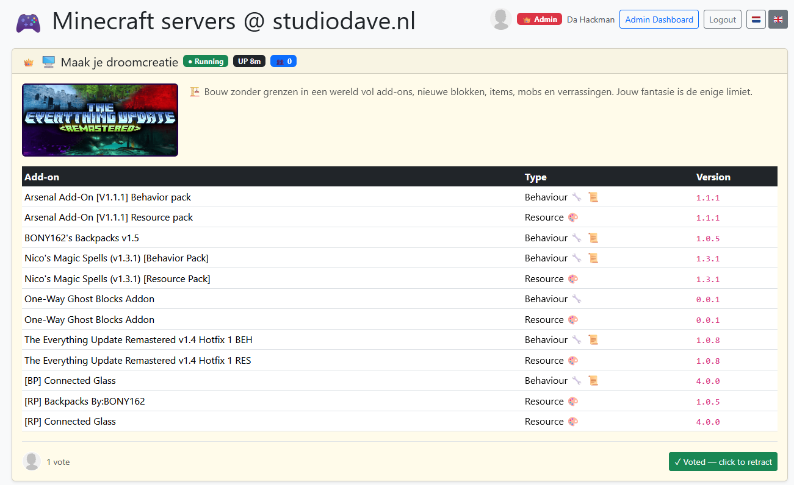
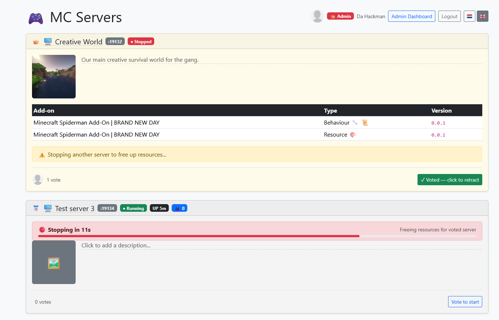
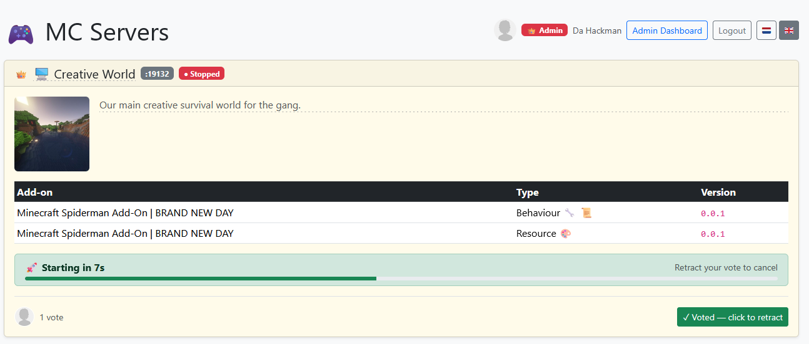

# 🧱 Minecraft Bedrock Add-on Manager

A web-based dashboard for managing add-ons (behaviour packs and resource packs) on your [itzg/minecraft-bedrock-server](https://github.com/itzg/docker-minecraft-bedrock-server) instances, with a public homepage, user authentication, live server status, and an admin interface for uploads, toggling and maintenance.


## Features

### Public homepage (`/`)
- 🌐 Public server status page visible to anyone, no login required
- 🖥️ Shows each server's display name, description and image (configured via `mc-server-manager/meta.yaml` inside the server data folder)
- ✏️ Admin-only inline editing for server display name, description and image upload directly on the homepage
- 🖼️ Uploaded images keep original dimensions; frontend CSS controls display size.
- 🟢 Live running status, uptime and online player count per server — pushed in real time via WebSocket
- 📦 Lists enabled add-ons (name, type, version) per server
- 👤 Shows logged-in user's Xbox gamertag and avatar with role badge (Admin / User / Anonymous)

### Voting system
- 🗳️ Players vote for which stopped server to start next — vote button always visible, retract at any time
- 🏅 Servers ranked by active vote count — gold/silver/bronze medals, cards reorder live (ties preserve position)
- ⏱️ 15-second countdown before auto-start fires, giving players time to retract
- 🔄 Auto-stop: if resources are insufficient, the highest-profile empty running server is stopped automatically to make room — only if no player-occupied server needs to be freed
- 🔋 Resource budget checker — slot-based memory profile system (`low`/`medium`/`high`) controls which server combinations may run simultaneously
- 💓 Heartbeat-based active vote filtering — votes only count while the browser tab is open (2-minute grace window)
- 🔒 Post-start cooldown prevents immediate re-triggering
- 💬 Live status messages: "lack of resources", "stopping server to free resources", "players online — waiting"

### Admin dashboard (`/admin`)
- 📋 Overview of all user-installed add-ons per server with enabled/disabled status
- ✅ Enable and disable add-ons with a single click
- ⬆️ Install add-ons by uploading `.mcaddon` or `.mcpack` files directly from the browser
- 🗑️ Remove add-ons with a confirmation dialog
- ➕ **Create new Minecraft servers** directly from the dashboard:
  - Set display name, optional seed, and memory profile
  - Auto-assigned deterministic port (`server1` → 19132, `server2` → 19133, etc.)
  - Docker container created and configured automatically via Docker API
  - **`allowlist.json` auto-created** with all users from `users.yaml` (skipped if file already exists)
  - **`permissions.json` auto-created** with admin-role users as operators (skipped if file already exists)
  - Server is created in stopped state — start manually or via voting
- 🔄 **Start**, restart or ⏹️ **Stop** your Minecraft server directly from the dashboard
  - Recreates the Docker container automatically if it was previously deleted (data folder is preserved)
  - On container recreation, `allowlist.json` and `permissions.json` are also auto-created if not yet present
- 🗑️ **Delete servers** from the dashboard with confirmation
  - Removes the Docker container (if present) and deletes the entire server data folder
- 🟦 Live **Loaded** status per add-on — shows whether each pack was actually loaded by the server on its last boot, detected via Docker log streaming
- 📊 Live **CPU%, memory usage, uptime and player count** per server container, updated via WebSocket every 10 seconds
- 🖥️ Host machine **memory and disk usage bars** showing total/used/available metrics
  - **Disk space monitoring** displays free space in GB and percentage used
  - **Disk threshold guard** (default: 4 GB free) prevents server creation when disk space is too low
  - Threshold configurable via `MIN_FREE_DISK_GB` env var
- 💻 **Send commands** to a running server directly from the dashboard, with a pre-configured command list from `commands.txt`
- 🐳 Automatic container detection via Docker API — no manual container name configuration needed
- ⚠️ Dependency validation — warns when a pack has unmet UUID dependencies
- ⚙️ Built-in system packs shown separately in a collapsed section
- 🔒 Version protection — prevents accidental downgrades when reinstalling a pack
- 🔁 Resource pack loaded state inferred from matching behaviour pack name in logs

### Authentication
- 🔐 Username/password login with sessions stored in Redis (survives container restarts)
- 👑 Role-based access: `ROLE_ADMIN` for the dashboard, `ROLE_USER` for the homepage
- 🎮 Xbox gamertag and xuid linked per user account
- 🖼️ User avatar displayed in navbar and homepage header
- 📝 Users configured via `users.yaml` (mounted at runtime, not committed to git)
- 🔑 Sessions persist for 30 days with automatic renewal on each visit

## Screenshots






## Prerequisites

- **Docker** installed on your host
- One or more running [itzg/minecraft-bedrock-server](https://github.com/itzg/docker-minecraft-bedrock-server) containers, each with its `/data` folder bind-mounted to a host path, e.g.:
  ```bash
  docker run -d \
    -e EULA=TRUE \
    -e MEMORY_PROFILE=medium \
    -p 19132:19132/udp \
    -v /home/user/minecraft-data:/data \
    --name mc-server \
    itzg/minecraft-bedrock-server
  ```
  `MEMORY_PROFILE` accepts `low`, `medium`, or `high` and is used by the resource budget system to determine which server combinations may run simultaneously.

## Installation

### 1. Clone and build

```bash
git clone https://github.com/marinhekman/minecraft-bedrock-server-add-on-manager.git
cd minecraft-bedrock-server-add-on-manager

docker build -t minecraft-bedrock-server-add-on-manager .
```

### 2. Configure environment

```bash
cp .env.example .env
```

Edit `.env`:

```env
# Generate with: openssl rand -hex 32
APP_SECRET=your_random_secret_here

# Use :80 for plain HTTP (recommended for local/LAN use)
SERVER_NAME=:80

# Site title — supports HTML entities, use &nbsp; instead of spaces
APP_TITLE_RAW=MC&nbsp;SERVERS

# Redis URL (used for sessions and live server state)
REDIS_URL=redis://mc-redis:6379

# Docker API URL (mc-docker-api container)
DOCKER_API_URL=http://mc-docker-api:2375

# WebSocket URL components (used by the browser to connect)
# Dev defaults (Docker Desktop):
URL_WS_SERVER_SCHEME=ws
URL_WEB_SERVER_HOST=host.docker.internal
URL_WS_SERVER_PORT=8082
URL_WS_SERVER_URI=

# Production (behind reverse proxy with wss):
# URL_WS_SERVER_SCHEME=wss
# URL_WEB_SERVER_HOST=minecraft.example.com
# URL_WS_SERVER_PORT=443
# URL_WS_SERVER_URI=/ws/

# Disk space guard — minimum free space in GB required to create new servers (default: 4)
# MIN_FREE_DISK_GB=4
```

### 3. Set up runtime data

```bash
mkdir -p ~/mc-server-manager-data/avatars
cp users.yaml.example ~/mc-server-manager-data/users.yaml
cp meta.yaml.example ~/mc-server-manager-data/meta.yaml
```

Edit `~/mc-server-manager-data/users.yaml`:

```yaml
users:
    yourname:
        # Generate with: docker exec -it mc-server-manager php bin/console security:hash-password
        password: '$2y$13$...'
        gamertag: 'YourXboxGamertag'
        xuid: '2535123456789'
        roles: ['ROLE_ADMIN']
```

Edit `~/mc-server-manager-data/meta.yaml` — see [`meta.yaml.example`](meta.yaml.example) for all options including resource limits.

Place user avatars (96×96px PNG) in `~/mc-server-manager-data/avatars/yourname.png`.

### 4. Optionally configure per-server metadata

Inside each `~/mc-servers/serverN` folder, create:

```
serverN/
    mc-server-manager/
        meta.yaml
        image.png
```

Uploaded images keep original dimensions; frontend CSS controls display size.

`meta.yaml` format — see [`server-meta.yaml.example`](server-meta.yaml.example).

### 5. Run

```bash
bash mc-server-manager-start.sh
```

The script automatically starts all required containers (`mc-docker-api`, `mc-redis`, `mc-server-manager`) and mounts your server data folders.

The dashboard is available at [http://localhost:8080](http://localhost:8080).
The WebSocket server runs on port 8082.

### 6. Password management

You can still generate a password hash manually:

```bash
docker exec -it mc-server-manager php bin/console security:hash-password
```

For day-to-day password management, the project also includes helper scripts in the repository root:

#### Set passwords interactively for existing users

```bash
bash set-passwords.sh
```

- Prompts for each username found in `~/mc-server-manager-data/users.yaml`
- Lets you skip individual users by leaving the password blank
- Confirms each password before updating `users.yaml`
- Uses the `mc-server-manager` container to generate Symfony password hashes

#### Reset passwords for all existing users

```bash
bash reset-passwords.sh
```

- Generates a random password for every username found in `~/mc-server-manager-data/users.yaml`
- Prints the generated password for each user to the terminal
- Updates `users.yaml` with freshly hashed passwords

> **Important:** These scripts only manage passwords for users that already exist in `users.yaml`. They do **not** create new user accounts. Create the user entries manually first, then use these scripts to set or reset passwords.

## Folder structure on host

```
~/
    mc-server-manager-data/
        meta.yaml               ← global config: resource limits, heartbeat TTL
        users.yaml              ← user accounts (not in git)
        commands.txt            ← optional command suggestions
        avatars/
            yourname.png        ← user avatars (96×96px)
    mc-servers/
        server1/                → mounted as /mc-data/server1 in manager
            mc-server-manager/
                meta.yaml       ← display name, description, heartbeat_ttl override
                image.png       ← server image (original dimensions preserved)
            behavior_packs/
            resource_packs/
            worlds/
            server.properties
        server2/                → mounted as /mc-data/server2 in manager
            ...
```

Each server data folder (`server1`, `server2`, etc.) is automatically detected and mounted into the manager container as `/mc-data/serverN`. New servers can be created via the admin dashboard, which generates the container and folder structure automatically.

## How it works

The manager mounts each Minecraft server's data folder (`server1`, `server2`, etc.) and reads/writes:

- `behavior_packs/*/manifest.json` — discovers installed behaviour packs
- `resource_packs/*/manifest.json` — discovers installed resource packs
- `worlds/Bedrock level/world_behavior_packs.json` — enables/disables behaviour packs
- `worlds/Bedrock level/world_resource_packs.json` — enables/disables resource packs
- `mc-server-manager/meta.yaml` — reads display name, description and per-server overrides
- `mc-server-manager/image.png` — reads server image

**Server creation**: New servers can be created via the admin dashboard, which:
- Generates a deterministic UDP port mapping: `server1` → 19132, `server2` → 19133, etc.
- Creates the Docker container with the correct environment, memory limit, and network configuration
- Creates the data folder structure on the host
- Writes the server metadata (display name) to `mc-server-manager/meta.yaml`
- Auto-creates `allowlist.json` from all users in `users.yaml` (only if file does not yet exist)
- Auto-creates `permissions.json` with admin users as operators (only if file does not yet exist)

It connects to the Docker API (via `mc-docker-api` container) to automatically match each data folder to its running container, retrieve port and status information, send restart/stop signals, and stream recent logs for pack load detection.

The WebSocket server (`app:websocket-server`, managed by Supervisor) pushes all live updates to connected browsers — no polling required.

User-installed packs are stored in folders prefixed with `user_` so they can be reliably distinguished from built-in server packs.

> **Note:** After enabling or disabling add-ons, the Minecraft server must be restarted for changes to take effect.

## Voting system

Players visit the homepage and vote for which stopped server to start next. The server with the most active votes triggers a 15-second countdown. If the resource budget allows starting alongside the currently running servers, it starts automatically. Otherwise the app may stop an empty running server first to free resources.

See [`VOTING_DESIGN.md`](VOTING_DESIGN.md) for full details and [`meta.yaml.example`](meta.yaml.example) for configuring resource limits.

## Updating

```bash
git pull
docker build --no-cache -t minecraft-bedrock-server-add-on-manager .
docker stop mc-server-manager && docker rm mc-server-manager
bash mc-server-manager-start.sh
```

## Security

Access to `/admin` requires `ROLE_ADMIN`. The public homepage at `/` is accessible anonymously but shows read-only information only.

The Docker API is accessed via the `mc-docker-api` sidecar container rather than a direct socket mount, reducing the attack surface. Container creation and deletion are limited to Minecraft servers via admin-only features that require `ROLE_ADMIN`.

Test/seed routes (`/test/seed/*`) require `ROLE_ADMIN` and are only useful in development.

## License

This project is licensed under the **GNU Affero General Public License v3.0 (AGPLv3)**.
You are free to use, modify, and distribute this software, but any modified version
must also be released under the AGPLv3, including when run as a network service.

If you build upon this project, the author kindly requests that you retain a visible credit:

> Based on [Minecraft Bedrock Add-on Manager](https://github.com/marinhekman/minecraft-bedrock-server-add-on-manager) by Marin Hekman.

See the [LICENSE](LICENSE) file for full details.
