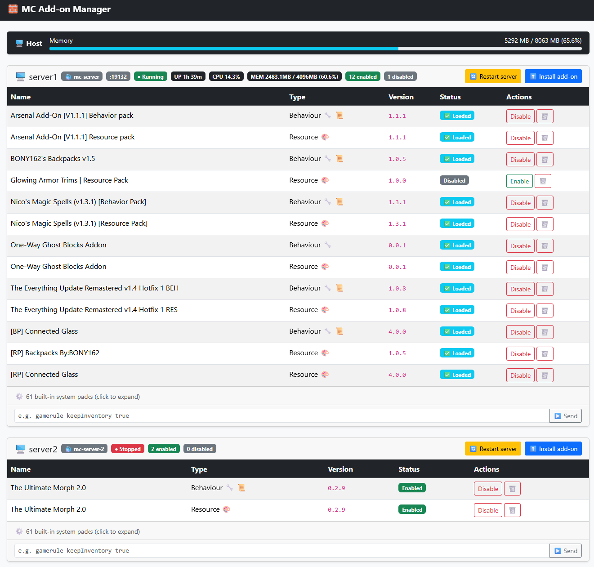

# 🧱 Minecraft Bedrock Add-on Manager

A web-based dashboard for managing add-ons (behaviour packs and resource packs) on your [itzg/minecraft-bedrock-server](https://github.com/itzg/docker-minecraft-bedrock-server) instances.


## Features

- 📋 Overview of all user-installed add-ons per server with enabled/disabled status
- ✅ Enable and disable add-ons with a single click
- ⬆️ Install add-ons by uploading `.mcaddon` or `.mcpack` files directly from the browser
- 🗑️ Remove add-ons with a confirmation dialog
- 🔄 Restart your Minecraft server directly from the dashboard
- 🐳 Automatic detection of running `itzg/minecraft-bedrock-server` containers via Docker API — no manual container name configuration needed
- ⚠️ Dependency validation — warns when a pack has unmet UUID dependencies, with a clickable popover showing the missing UUIDs
- ⚙️ Built-in system packs (vanilla, chemistry, experimental) are shown separately in a collapsed section, keeping the main view clean
- 🔒 Version protection — prevents accidental downgrades when reinstalling a pack

## Screenshot



## Prerequisites

- **Docker** installed on your host
- One or more running [itzg/minecraft-bedrock-server](https://github.com/itzg/docker-minecraft-bedrock-server) containers, each with its `/data` folder bind-mounted to a host path, e.g.:
  ```bash
  docker run -d \
    -e EULA=TRUE \
    -p 19132:19132/udp \
    -v /home/user/minecraft-data:/data \
    --name mc-server \
    itzg/minecraft-bedrock-server
  ```

## Installation

### 1. Clone and build

```bash
git clone https://github.com/marinhekman/minecraft-bedrock-server-add-on-manager.git
cd minecraft-bedrock-server-add-on-manager

docker build -t minecraft-bedrock-server-add-on-manager .
```

### 2. Configure environment

```bash
cp .env.example .env
```

Edit `.env`:

```env
# Generate with: openssl rand -hex 32
APP_SECRET=your_random_secret_here

# Use :80 for plain HTTP (recommended for local/LAN use)
SERVER_NAME=:80
```

### 3. Run

```bash
docker run -d \
  --name mc-server-manager \
  --restart unless-stopped \
  --env-file .env \
  -v /var/run/docker.sock:/var/run/docker.sock \
  -v /home/user/minecraft-data:/mc-data/server1 \
  -p 8080:80 \
  minecraft-bedrock-server-add-on-manager
```

To manage **multiple servers**, add a `-v` flag for each:

```bash
docker run -d \
  --name mc-server-manager \
  --restart unless-stopped \
  --env-file .env \
  -v /var/run/docker.sock:/var/run/docker.sock \
  -v /home/user/minecraft-data:/mc-data/server1 \
  -v /home/user/second-minecraft-data:/mc-data/server2 \
  -p 8080:80 \
  minecraft-bedrock-server-add-on-manager
```

The name after `/mc-data/` (e.g. `server1`, `server2`) is used as the display label in the dashboard. The dashboard is available at [http://localhost:8080](http://localhost:8080).

If no `-v` mounts are provided for `/mc-data/`, the dashboard will show a message indicating no servers are configured.

## How it works

The manager mounts each Minecraft server's `minecraft-data` folder and reads/writes:

- `behavior_packs/*/manifest.json` — discovers installed behaviour packs
- `resource_packs/*/manifest.json` — discovers installed resource packs
- `worlds/Bedrock level/world_behavior_packs.json` — enables/disables behaviour packs
- `worlds/Bedrock level/world_resource_packs.json` — enables/disables resource packs

It connects to the Docker socket to automatically match each mounted data folder to its running container, retrieve port and status information, and send restart signals.

User-installed packs are stored in folders prefixed with `user_` (e.g. `behavior_packs/user_MyPack_abc12345/`) so they can be reliably distinguished from built-in server packs.

> **Note:** After enabling or disabling add-ons, the Minecraft server must be restarted for changes to take effect. Use the **Restart server** button on the dashboard.

## Updating

```bash
git pull
docker build --no-cache -t minecraft-bedrock-server-add-on-manager .
docker stop mc-server-manager && docker rm mc-server-manager
# Re-run the docker run command from step 3
```

## Security

This tool is intended for use on a **trusted local network**. It has no authentication layer. Do not expose it directly to the internet.

The Docker socket is mounted to allow container discovery and restart signals. No containers are created or deleted by this application.

## License

MIT
